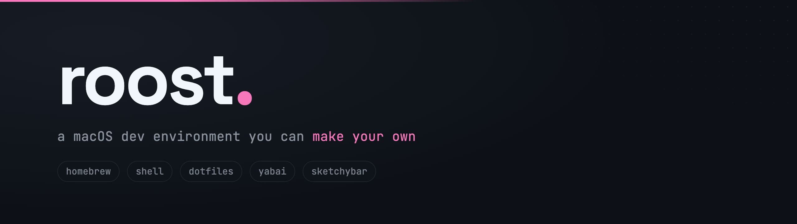

# roost

A macOS development environment you can make your own: Homebrew packages, shell setup, Dotbot-managed configs, and optional window management (yabai / skhd / SketchyBar).

## Features

- Configurable: pick between CLI tools, GUI apps, shell configuration, base configs, window management, SketchyBar, [macOS defaults](https://github.com/mathiasbynens/dotfiles), and setup for the features it installs.
- Rich UI: [`gum`](https://github.com/charmbracelet/gum) is used when available to make our interfaces gorgeous. There is a plain-prompt fallback and a non-interactive fallback as well!
- YAGNI: within a chosen feature set, deselect individual formulae/casks/apps you don't want/need.
- Git Identity: first run prompts your Git identity (name, email, optional GPG signing keys) and writes it into `configs/git/gitconfig` before linking.

## Quick Start

### Bootstrap

```bash
curl -sSL https://raw.githubusercontent.com/raven-pierce/roost/main/bootstrap.sh | bash
```

To override the clone location or repo:

```bash
DOTFILES_DIR=~/.dotfiles DOTFILES_REPO=https://github.com/raven-pierce/roost.git bash <(curl -sSL https://raw.githubusercontent.com/raven-pierce/roost/main/bootstrap.sh)
```

### Manual

```bash
git clone https://github.com/raven-pierce/roost.git ~/.dotfiles
cd ~/.dotfiles
git submodule update --init --recursive
./scripts/install.sh
```

## Installer

On a terminal with no flags, you get the interactive feature-first picker. Away from a TTY (CI, pipes), pass components or `--all`; no prompts are shown.

```bash
./scripts/install.sh # interactive picker
./scripts/install.sh --packages --shell --configs
./scripts/install.sh --brew-wm --wm-configs --wm-services # WM only, end to end
./scripts/install.sh --packages --no-brew-apps --brew-sketchybar --no-brew-wm
./scripts/install.sh --all --dry-run
./scripts/install.sh --macos # system defaults only
COMPUTER_NAME="MyMac" ./scripts/install.sh --macos
./scripts/install.sh --reset-yabai # fix broken yabai SA after an upgrade
```

| Flag                                         | Function                                                                 |
| -------------------------------------------- | ------------------------------------------------------------------------ |
| `--packages`                                 | Install from root `Brewfile` (see brew groups)                           |
| `--brew-cli` / `--no-brew-cli`               | Toggle CLI / fonts group                                                 |
| `--brew-apps` / `--no-brew-apps`             | Toggle GUI casks + Mac App Store group                                   |
| `--brew-wm` / `--no-brew-wm`                 | Toggle yabai / skhd / borders group                                      |
| `--brew-sketchybar` / `--no-brew-sketchybar` | Toggle SketchyBar, lua, luarocks, audio helpers                          |
| `--shell`                                    | Oh My Zsh, Powerlevel10k, nvm, fzf plugin                                |
| `--configs`                                  | Base dotfiles — git / shell / editors (`install.conf.yaml`)              |
| `--wm-configs`                               | Window-manager configs — yabai / skhd / borders (`install.wm.conf.yaml`) |
| `--sketchybar-configs`                       | SketchyBar config (`install.sketchybar.conf.yaml`)                       |
| `--wm-services`                              | Start window-manager services (yabai / skhd / borders)                   |
| `--sketchybar-service`                       | Start the SketchyBar service                                             |
| `--services`                                 | Start both WM and SketchyBar services                                    |
| `--macos`                                    | Apply `scripts/macos.sh` defaults                                        |
| `--all`                                      | Everything above (all brew groups on)                                    |
| `--reset-yabai`                              | Reinstall the yabai scripting addition (after a yabai upgrade)           |
| `--yes` / `-y`                               | Accept prompt defaults where used                                        |
| `--dry-run` / `-n`                           | Print the plan only                                                      |

An explicitly named brew group (e.g. `--brew-wm`) implies `--packages` and enables only that group.

YAGNI per-package pruning is interactive-only (it needs `gum`'s multi-select); flag-driven and non-interactive runs install whole enabled groups.

The Brewfile is normal Homebrew Ruby. Groups are gated with `DOTFILES_BREW_CLI`, `DOTFILES_BREW_APPS`, `DOTFILES_BREW_WM`, and `DOTFILES_BREW_SKETCHYBAR` (default `1` if unset), so a plain `brew bundle` still installs everything.

## Layout

```
.
├── bootstrap.sh
├── install                       # dotbot wrapper (-c CONFIG)
├── install.conf.yaml             # base dotfiles (git / shell / editors)
├── install.wm.conf.yaml          # window-manager configs (yabai / skhd / borders)
├── install.sketchybar.conf.yaml  # SketchyBar config
├── Brewfile                      # one bundle; groups selectable via env/flags
├── scripts/
│   ├── install.sh                # orchestrator + feature-first picker
│   ├── global_fn.sh              # shared helpers + gum-backed UI
│   ├── brewfile.sh               # Brewfile parse/filter for per-package pruning
│   ├── install_pre.sh
│   ├── install_pkg.sh
│   ├── install_shell.sh
│   ├── install_services.sh
│   ├── install_sketchybar.sh
│   ├── macos.sh
│   └── reset_yabai.sh
├── tests/                        # bats unit tests (make test)
└── configs/                      # linked into $HOME / ~/.config
```

## After Installation

1. Restart the terminal or `source ~/.zshrc`
2. Run `p10k configure` if you installed the shell stack
3. Log out/in after enabling window management; grant Accessibility if macOS asks
4. Optional full yabai: disable SIP only if you accept the security tradeoff

### Yabai Upgrades

Yabai's scripting addition must be reinstalled whenever yabai updates. Run:

```bash
./scripts/install.sh --reset-yabai
```

This reinstalls the scripting addition and refreshes the hash-pinned sudoers entry (you will be prompted for your password).

## Customize

- Git Identity: the repo ships `configs/git/gitconfig` with no `[user]` section. On first `--configs` run you are prompted for name, email, and whether to enable GPG signing (choosing a key from your keyring), and the values are written straight into `configs/git/gitconfig` before Dotbot links it. Since you fork first, personalizing the tracked file is expected; run `git update-index --skip-worktree configs/git/gitconfig` if you want to keep your details out of future commits.
- Packages: in the interactive picker, deselect individual packages per feature; for permanent changes edit `Brewfile` (keep the `if cli` / `if apps` / `if wm` / `if sbar` guards), then re-run with the group flags you want.
- Configs: edit under `configs/`, update the matching Dotbot YAML (`install.conf.yaml`, `install.wm.conf.yaml`, `install.sketchybar.conf.yaml`), then run `./install -c <file>`.
- Hostname: choosing macOS system defaults in the interactive picker prompts for a hostname (blank keeps the current one). For flag-driven runs, set it via the environment: `COMPUTER_NAME=MyMac ./scripts/install.sh --macos` (or `COMPUTER_NAME=MyMac ./scripts/macos.sh`).
- Touch ID for sudo: if [`mole`](https://mole.fit) is installed (the `mo` CLI, part of the CLI group), the interactive installer offers to run `mo touchid enable` so `sudo` accepts your fingerprint. It's offered before the sudo-heavy macOS-defaults step; skipped in `--yes` / non-interactive runs. You can enable it later by hand with `mo touchid enable`.

## Key bindings

See `configs/skhd/skhdrc` for the full map. Highlights:

| Binding           | Action                     |
| ----------------- | -------------------------- |
| `⌥ + H/J/K/L`     | Focus window               |
| `⇧ + ⌥ + H/J/K/L` | Swap windows               |
| `⇧ + ⌥ + F`       | Toggle fullscreen          |
| `⌃ + ⌥ + B/F/S`   | BSP / float / stack layout |

## Troubleshooting

- Homebrew Issues: `brew doctor`
- WM Issues: `brew services list`; check Accessibility for your terminal / yabai / skhd; run the `--reset-yabai` script.
- SketchyBar: `./scripts/install_sketchybar.sh` then `brew services restart sketchybar`
- Broken Symlinks: `./install` again, or `find ~ -type l -exec test ! -e {} \; -print`

## License

GNU GPLv3 — see [`LICENSE`](LICENSE). Configurations and scripts are provided as-is; fork and remix freely under the license terms.
